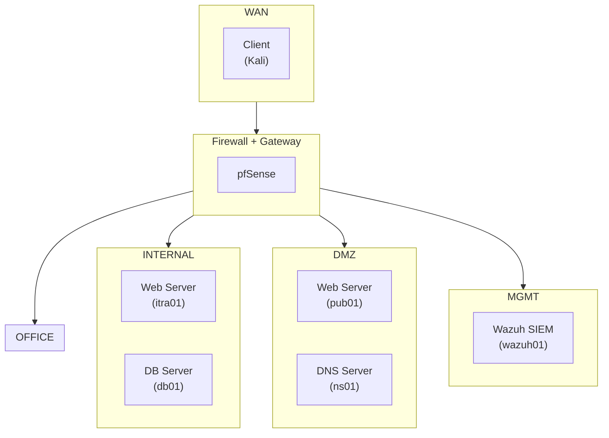
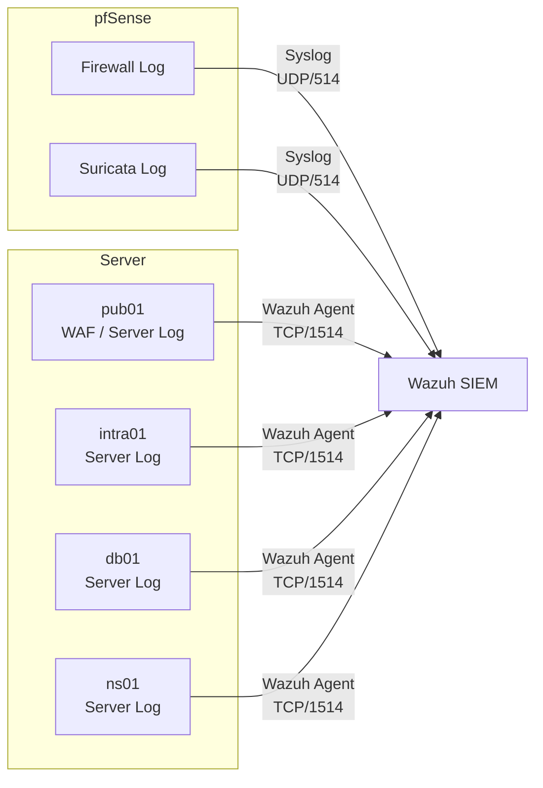

# infra-lab

VMware 기반 가상환경에 기업 네트워크를 단순화한 인프라를 구성하고, Firewall, IDS/IPS, WAF, SIEM을 연계하여 보안 정책의 동작을 검증하는 프로젝트입니다.

## 목표

- 기본 인프라 서버 구축
- 네트워크 영역 분리
- Firewall 기반 접근 통제
- IDS/IPS 적용
- WAF 적용
- SIEM 기반 로그 수집 및 이벤트 확인
- 테스트를 통한 보안 정책 검증

## 주요 구성

- 가상환경 : VMware Workstation
- 인프라 서버 : Web / DB / DNS
- 방화벽 / 게이트웨이 : pfSense
- IDS/IPS : Suricata
- WAF : ModSecurity + OWASP CRS
- SIEM : Wazuh

## 네트워크 구성 및 트래픽 흐름

## 로그 수집 흐름

## 상세 문서

- [01. 프로젝트 설계](docs/01_프로젝트_설계.md)
- [02. VMware 환경 구축](docs/02_VMware_환경_구축.md)
- [03. 인프라 구축](docs/03_인프라_구축.md)
- [04. 보안 구축](docs/04_보안_구축.md)
- [05. 보안 정책](docs/05_보안_정책.md)
- [06. 보안 테스트](docs/06_보안_테스트.md)
