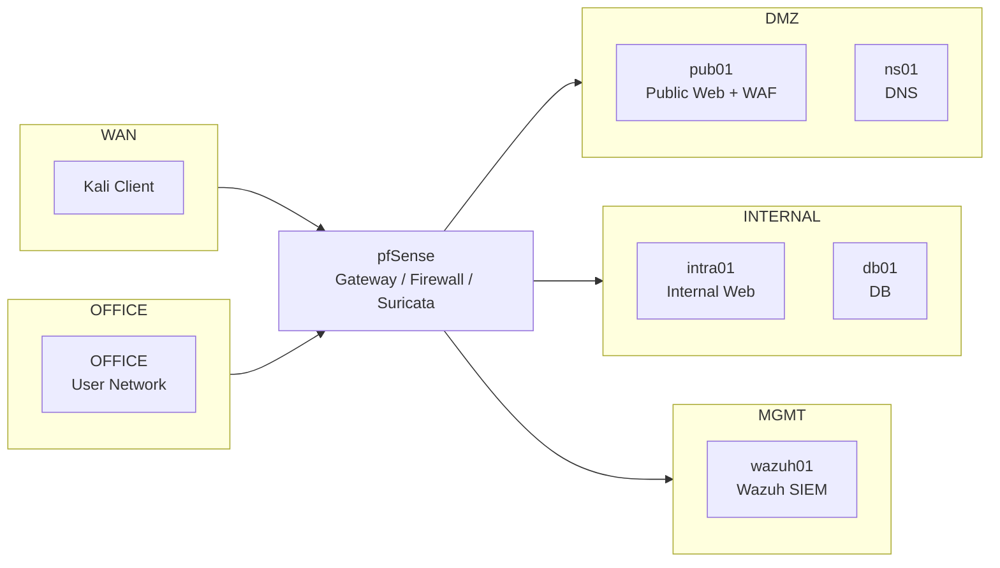
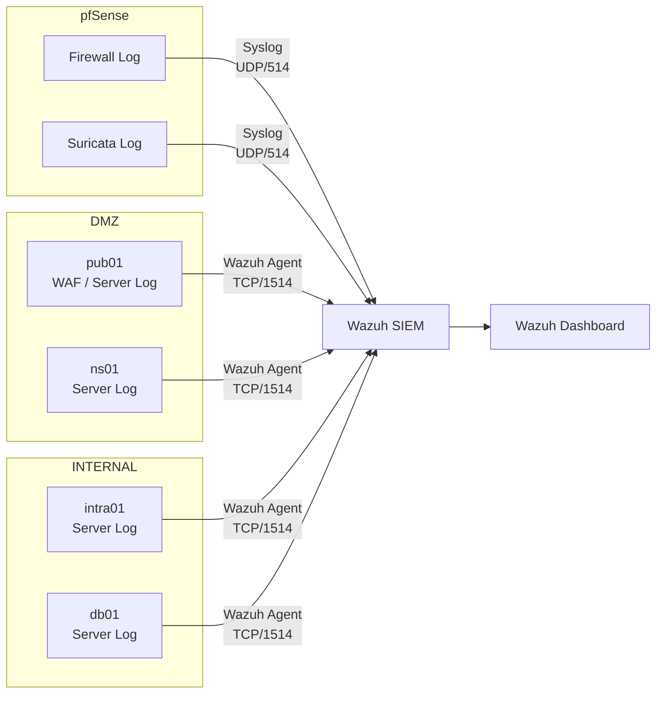

# 01. 프로젝트 설계

## 1. 설계 목적

실제 네트워크 환경에서 Firewall, IDS/IPS, WAF, SIEM 등 개별적인 보안 솔루션들이 각자 어떤 위치에서 어떤 역할을 수행하는지 확인하기 위해 기업 네트워크를 단순화한 가상환경을 설계하였다.

보호 대상 인프라와 네트워크 영역을 구성하고, 접근 통제·탐지·차단·로그 수집으로 이어지는 전체 보안 흐름을 구현하는 것을 목표로 한다.

## 2. 설계 원칙

- 역할과 노출 범위에 따라 네트워크 영역을 분리하고, 영역간 통신은 pfSense를 통해 통제한다.
- 네트워크 및 애플리케이션 계층의 위협을 탐지·차단할 수 있도록 IDS/IPS와 WAF를 배치한다.
- 서버 및 보안 시스템의 로그를 SIEM으로 통합하고, 적용한 정책은 테스트를 통해 검증한다.

## 3. 네트워크 및 서버 아키텍처

### 3.1 네트워크 영역 설계

| 네트워크 영역 | 역할 |
| --- | --- |
| WAN | 외부 네트워크 |
| OFFICE | 사용자 네트워크 |
| INTERNAL | 내부 서버 네트워크 |
| DMZ | 외부 공개 서비스 네트워크 |
| MGMT | 관리 및 보안 시스템 네트워크 |

### 3.2 서버 및 서비스 배치

| 시스템 | 배치 영역 | 역할 |
| --- | --- | --- |
| pfSense | 네트워크 경계 | Gateway / Firewall / IDS·IPS |
| pub01 | DMZ | 외부 공개 Web / WAF |
| ns01 | DMZ | DNS |
| intra01 | INTERNAL | 내부 Web |
| db01 | INTERNAL | DB |
| wazuh01 | MGMT | SIEM |
| Kali | WAN | 테스트 Client |

## 4. 보안 설계

### 4.1. 접근 통제
- 네트워크 영역 간 통신을 pfSense Firewall을 통해 제어
- 필요한 서비스 통신만 허용하고, 그 외 통신은 차단

### 4.2. 탐지 및 차단
- Suricata IDS/IPS를 통해 네트워크 트래픽에서 공격 패턴을 탐지·차단
- 외부 공개 Web 서비스에 대한 WAF를 적용하여 웹 공격을 탐지·차단

### 4.3. 로그 수집
- 서버 및 보안 시스템의 로그를 Wazuh SIEM으로 통합하여 수집
- 수집된 이벤트를 Dashboard에서 확인

> pfSense Firewall 및 Suricata 로그는 Syslog를 통해 전달하고, 서버 및 WAF 로그는 Wazuh Agent를 통해 수집한다. 수집된 이벤트는 Wazuh Dashboard에서 확인한다.

## 5. 검증 계획

구성한 보안 정책과 시스템이 의도한 대로 동작하는지 다음 항목을 중심으로 검증한다.

- 네트워크 영역 간 접근통제
- 내부/외부 DNS 동작 및 접근 정책
- Suricata IDS/IPS 탐지·차단
- WAF 웹 공격 탐지·차단
- Firewall / IDS / WAF / Server 로그의 Wazuh 수집 및 이벤트 확인

