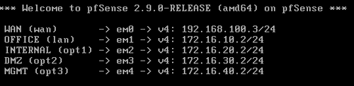

# 03. 인프라 구축

본 문서는 각 인프라 서버와 pfSense의 주요 구축 내용을 정리한다.

## 1. 구축 환경
| 서버 | OS | 주요 서비스 | 네트워크 |
| --- | --- | --- | --- |
| pfSense | pfSense CE 2.9.0 | Firewall / Router | 게이트웨이 |
| intra01 | Rocky Linux 9.8 | Apache | INTERNAL |
| pub01 | Rocky Linux 9.8 | Apache | DMZ |
| db01 | Rocky Linux 9.8 | MariaDB | INTERNAL |
| ns01 | Rocky Linux 9.8 | BIND | DMZ |
| wazuh01 | Rocky Linux 9.8 | Wazuh | MGMT |

## 2. pfSense

pfSense를 전체 가상 네트워크의 Gateway 및 Firewall로 구성하였다.

- WAN, OFFICE, INTERNAL, DMZ, MGMT 5개의 네트워크 인터페이스 구성
- 각 내부 네트워크 간 Routing을 pfSense를 통해 수행
- WAN은 VMware NAT 네트워크와 연결하여 외부 네트워크 통신 구성
- 내부 네트워크의 외부 통신을 위한 NAT 구성
- 구성된 pfSense 인터페이스 및 IP 주소는 다음과 같다.

- 세부 네트워크 접근통제 정책은 05_보안_정책에서 별도로 정리한다.

## 3. Web

intra01과 pub01에 Apache Web Server를 구성하였다.

- intra01 : INTERNAL 네트워크의 내부 업무용 Web 서비스
- pub01 : DMZ 영역의 외부 공개 Web 서비스
- Web 서비스와 db01 간 연동

## 4. DB

db01에 MariaDB를 구성하여 Web 서비스에서 사용할 데이터를 저장하도록 구성하였다.

- Web 서비스용 Database 및 User 구성
- 필요한 Web 서버에서 DB에 접근할 수 있도록 연동

## 5. DNS

ns01에 BIND DNS Server를 구성하였다.

- `infralab.test` Zone 구성
- `internal` / `dmz-recursive` / `external` View를 이용한 DNS 응답 분리
    - `internal` View는 내부 서비스 정보를 제공하고, Recursive Query 허용
    - `dmz_recursive` View는 외부 서비스 정보만 제공하고, Recursive Query 허용
    - `external` View는 외부 서비스 정보만 제공하고, Recursive Query 차단
    
## 6. Wazuh

wazuh01에 Wazuh All-in-One 구성을 적용하였다.

- Wazuh Manager, Indexer, Dashboard를 단일 서버에 구성
- Dashboard를 통한 보안 이벤트 조회 및 관리 환경 구성
- 서버 Agent 및 외부 보안 로그를 수집할 수 있도록 기본 수집 환경 구성
- 세부 Agent 연동, pfSense 로그 수집 및 Decoder / Rule 구성은 04_보안_구축에서 별도로 정리한다.