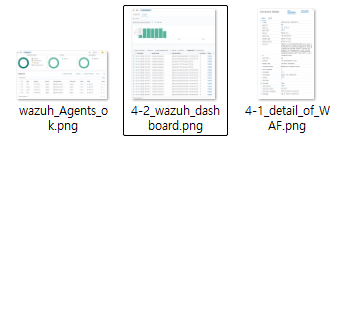
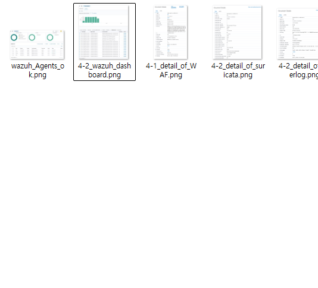
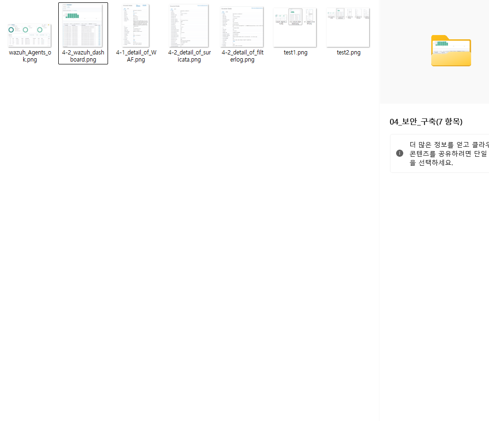
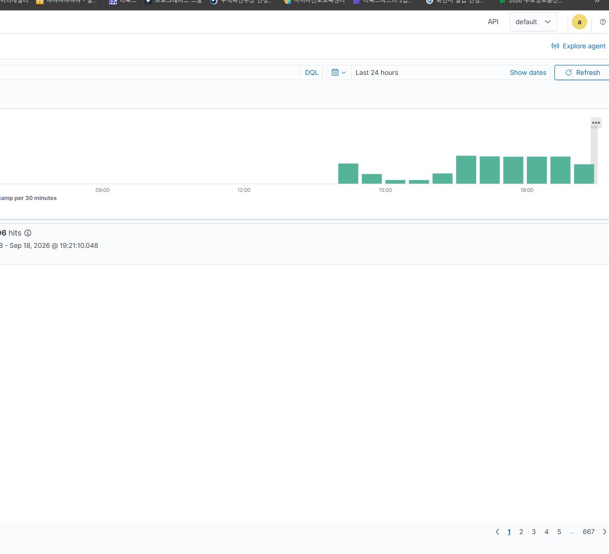

# 04 보안 구축

## 1. Suricata

pfSense에 Suricata IDS/IPS를 설치하고 네트워크 경계 및 주요 서버 영역의 트래픽을 검사하도록 구성하였다.

- WAN 인터페이스에 Suricata 적용
    #### - DMZ, INTERNAL 인터페이스는 동일한 방식으로 추가 구성 예정
- HTTP, TLS, DNS 및 Flow 정보를 EVE JSON 형식으로 기록
- Alert 및 Drop 이벤트 기록 활성화
- EVE 로그를 Wazuh와 연동할 수 있도록 구성
- 세부 Rule Set 및 Custom Rule은 05_보안_정책에서 별도로 정리한다.

## 2. WAF

pub01의 Apache Web Server에 ModSecurity와 OWASP Core Rule Set(CRS)을 적용하여 WAF를 구성하였다.

- ModSecurity 2.9.6을 Apache 모듈로 적용
- OWASP CRS 3.3.5 적용
- `SecRuleEngine On`으로 탐지 및 차단 기능 활성화
- 세부 Rule 정책 및 Custom Rule은 05_보안_정책에서 별도로 정리한다.

## 3. Wazuh
구축된 Wazuh 서버에서 각 시스템의 로그를 수집·확인할 수 있도록 연동하였다.

- intra01, pub01, db01, ns01에 Wazuh Agent 설치 및 Manager 연동 (1514/tcp, 1515/tcp)
- pfSense Firewall 로그를 Syslog 방식으로 wazuh01에 전송 (514/udp)
- pfSense `filterlog`는 기본 Decoder만으로 일부 필드가 정상적으로 파싱되지 않아, Hostname 및 주요 필드를 처리할 수 있도록 Custom Decoder / Rule 구성
- Wazuh Dashboard에서 Agent 상태 및 Firewall 이벤트 수집 여부 확인

## 4. 로그 수집 및 연동 확인

구성한 서버 및 보안 시스템에서 발생하는 로그가 Wazuh Manager로 정상적으로 전달되고 이벤트로 생성되는지 확인하였다.

### 4.1. Agent 기반 로그 수집 확인

intra01, pub01, db01, ns01에 설치한 Wazuh Agent가 Manager와 정상적으로 연결된 상태임을 확인하였다.

pub01의 Apache 'error_log'를 통해 수집된 ModSecurity 이벤트가 Wazuh에서 정상적으로 탐지되는 것을 확인하였다.

### 4.2. pfSense 기반 로그 수집 확인

pfSense에서 발생하는 Firewall 로그를 Remote Syslog를 통해 Wazuh Manager로 전달하고, Custom Decoder 및 Rule을 적용하여 이벤트가 정상적으로 생성되는 것을 확인하였다.

pfSense에서 동작하는 Suricata IDS/IPS의 Alert 로그가 Wazuh에서 수집되는지 확인하였다.

본 문서는 가상화 환경에서 구성한 네트워크 및 보안 시스템의 구축 과정을 정리한 자료이다.
각 서버와 네트워크 구간은 역할에 따라 분리하여 구성하였다.
방화벽, IDS/IPS, WAF, SIEM을 적용하여 기본적인 보안 기능을 구현하였다.
구성 이후에는 테스트 트래픽을 발생시켜 탐지 및 차단 여부를 확인하였다.
세부 설정과 검증 결과는 각 항목별로 구분하여 정리하였다.

이 환경은 실제 기업 인프라를 단순화하여 구성한 실습용 네트워크이다.
내부망, DMZ, 관리망을 분리하고 각 구간에 필요한 서비스를 배치하였다.
보안 장비와 서버 간 로그 연동을 통해 이벤트를 중앙에서 확인할 수 있도록 구성하였다.
주요 설정은 재현이 가능하도록 문서화하였으며, 테스트 결과도 함께 기록하였다.
전체 구성은 기능 검증과 학습을 목적으로 작성되었다.

테스트 과정에서는 정상 트래픽과 탐지 대상 트래픽을 각각 발생시켰다.
발생한 이벤트는 각 보안 시스템의 로그와 대시보드를 통해 확인하였다.
필요한 경우 Custom Decoder와 Rule을 적용하여 로그를 분류하였다.
각 단계에서 설정 변경 후 정상 동작 여부를 확인한 뒤 다음 작업을 진행하였다.
최종적으로 주요 보안 이벤트가 정상적으로 수집되는 것을 확인하였다.

테스트 과정에서는 정상 트래픽과 탐지 대상 트래픽을 각각 발생시켰다.
발생한 이벤트는 각 보안 시스템의 로그와 대시보드를 통해 확인하였다.
필요한 경우 Custom Decoder와 Rule을 적용하여 로그를 분류하였다.
각 단계에서 설정 변경 후 정상 동작 여부를 확인한 뒤 다음 작업을 진행하였다.
최종적으로 주요 보안 이벤트가 정상적으로 수집되는 것을 확인하였다.

