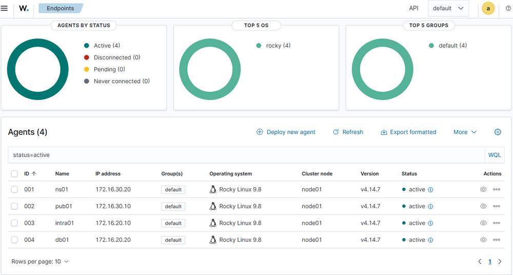
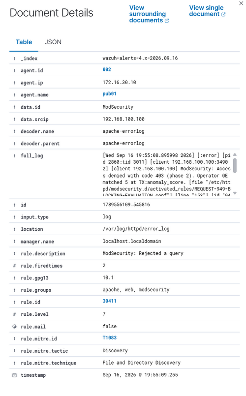
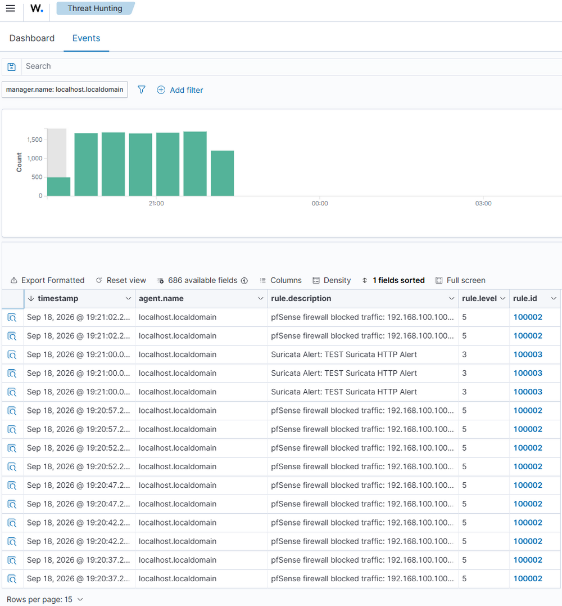
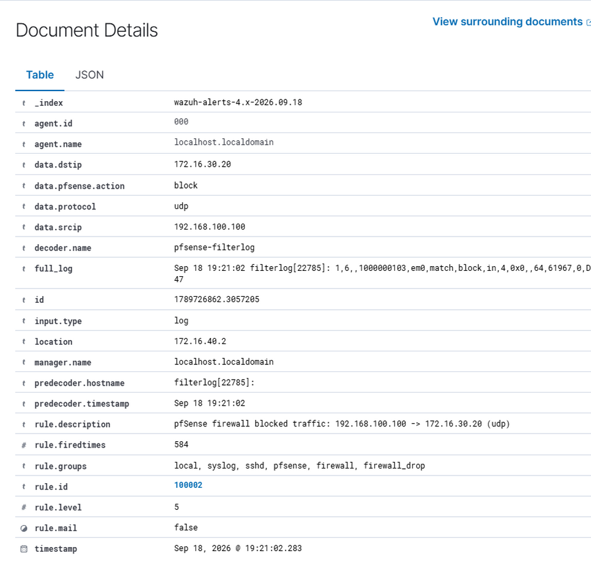
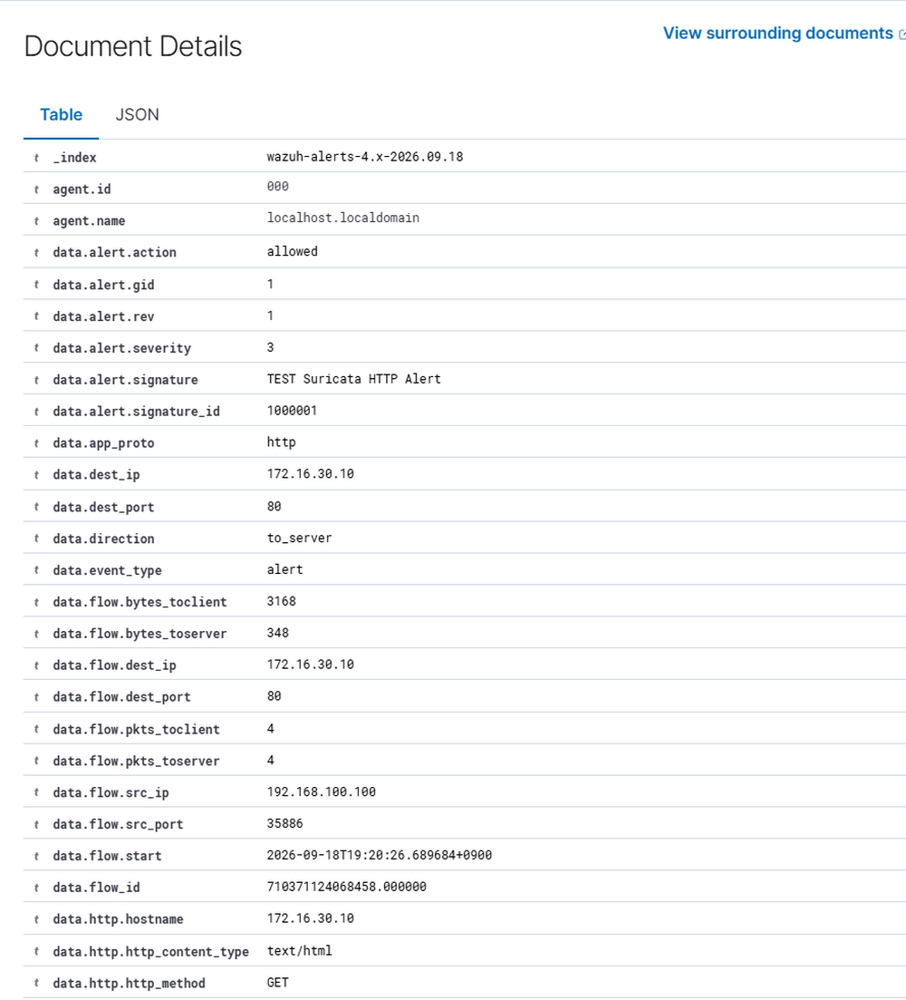

# 04 보안 구축

본 문서는 Suricata, WAF 및 Wazuh 로그 연동 등 보안 시스템의 주요 구축 내용을 정리한다.

## 1. Suricata

pfSense에 Suricata IDS/IPS를 설치하고 WAN 인터페이스의 트래픽을 검사하도록 구성하였다.

- WAN 인터페이스에 Suricata 적용
- HTTP, TLS, DNS 및 Flow 정보를 EVE JSON 형식으로 기록
- Alert 및 Drop 이벤트 기록 활성화
- EVE JSON Alert 로그를 Wazuh와 연동
- 세부 Rule Set 및 Custom Rule은 05_보안_정책에서 별도로 정리한다.

## 2. WAF

pub01의 Apache Web Server에 ModSecurity와 OWASP Core Rule Set(CRS)을 적용하여 WAF를 구성하였다.

- ModSecurity 2.9.6을 Apache 모듈로 적용
- OWASP CRS 3.3.5 적용
- `SecRuleEngine On`으로 탐지 및 차단 기능 활성화
- WAF 정책은 OWASP CRS 기본 Rule Set을 기반으로 구성하고, 세부 내용은 05_보안_정책에서 정리한다.

## 3. Wazuh
구축된 Wazuh 서버에서 각 시스템의 로그를 수집·확인할 수 있도록 연동하였다.

- intra01, pub01, db01, ns01에 Wazuh Agent를 설치하고 Manager에 연동 (TCP/1514, TCP/1515)
- pfSense Firewall 로그를 Syslog 방식으로 wazuh01에 전송 (UDP/514)
- pfSense `filterlog`는 기본 Decoder만으로 일부 필드가 정상적으로 파싱되지 않아, Hostname 및 주요 필드를 처리할 수 있도록 Custom Decoder / Rule 구성
- pfSense Suricata의 EVE JSON Alert 로그를 Wazuh Manager로 전달하고 Custom Decoder / Rule 적용
- Wazuh Dashboard에서 Agent 상태 및 Firewall, Suricata, WAF 이벤트 수집 여부 확인

## 4. 로그 수집 및 연동 확인

구성한 서버 및 보안 시스템에서 발생하는 로그가 Wazuh Manager로 정상적으로 전달되고 이벤트로 생성되는지 확인하였다.

### 4.1. Agent 기반 로그 수집 확인

intra01, pub01, db01, ns01에 설치한 Wazuh Agent가 Manager와 정상적으로 연결된 상태임을 확인하였다.

pub01에서는 Wazuh Agent가 Apache `error_log`를 수집하도록 구성하였다.
ModSecurity에서 발생한 차단 이벤트가 Wazuh로 전달되고 Alert로 생성되는 것을 확인하였다.

### 4.2. pfSense 기반 로그 수집 확인

pfSense에서 발생하는 Firewall 로그를 Remote Syslog를 통해 Wazuh Manager로 전달하였다.
수신한 `filterlog`에 Custom Decoder 및 Rule을 적용하여 차단 이벤트의 출발지/목적지 IP, Protocol 등의 필드를 분류하고 Alert가 정상적으로 생성되는 것을 확인하였다.

pfSense에서 동작하는 Suricata IDS/IPS의 EVE JSON Alert 로그를 Wazuh Manager로 전달하도록 구성하였다.
수신한 로그에 Custom Decoder 및 Rule을 적용하여 Suricata의 탐지 정보가 Wazuh Alert로 생성되는 것을 확인하였다.

