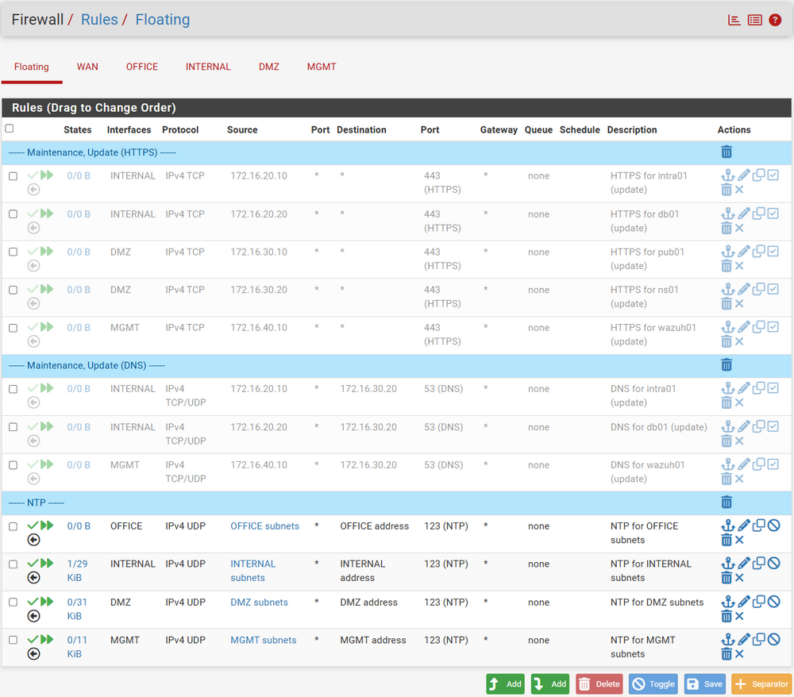
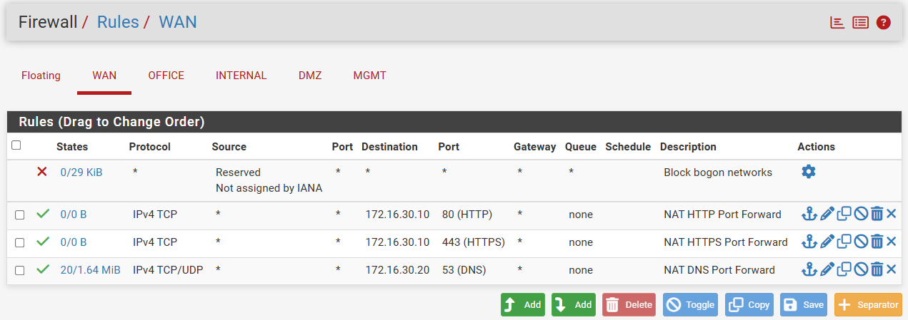
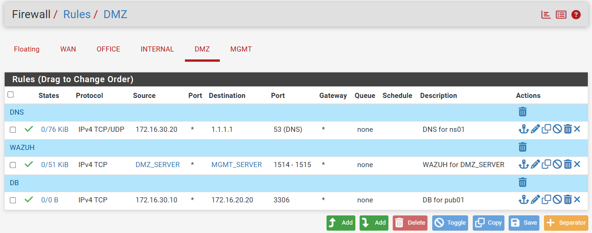
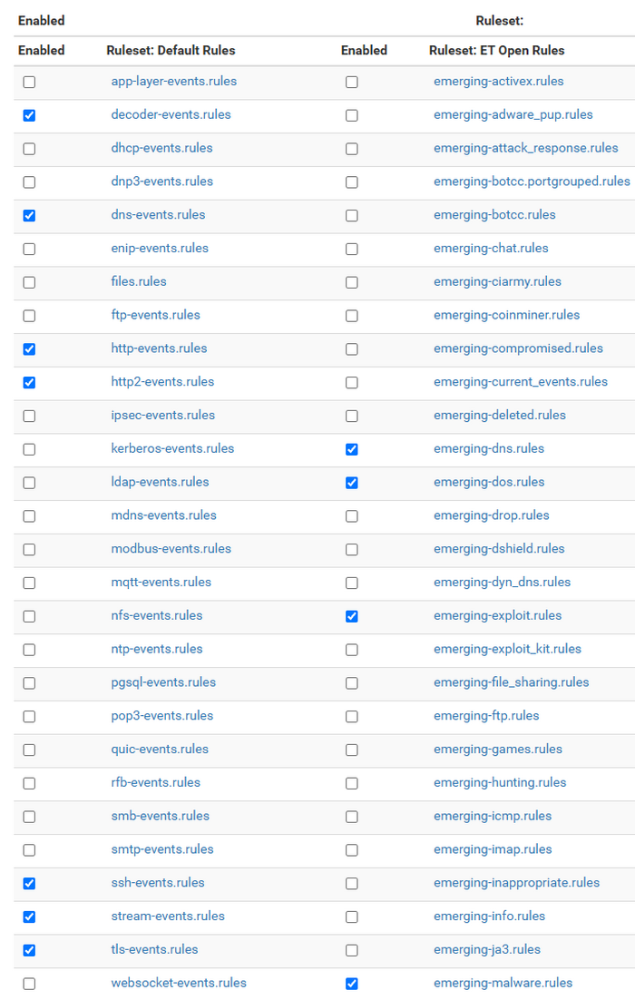
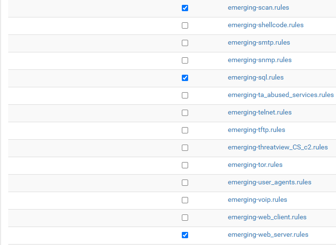
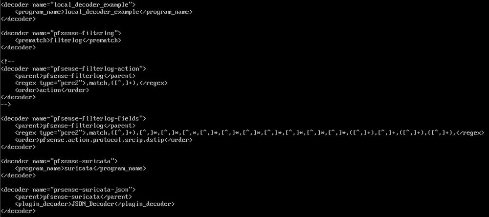
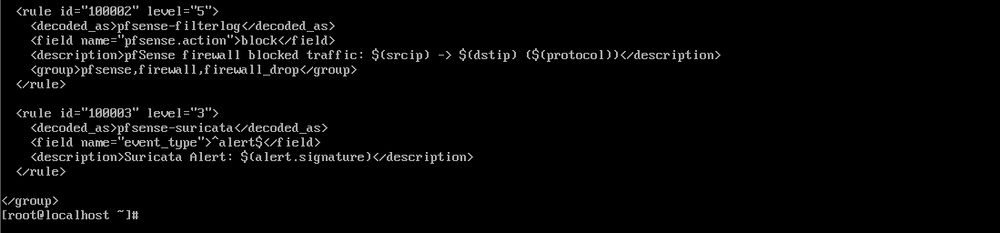

# 05 보안 정책

## 1 pfSense Firewall

### 1.1. 방화벽 정책 개요
- Stateful Firewall 기반으로 연결상태를 추적하여 응답 트래픽을 허용
- 필요한 통신만 명시적으로 허용하고, 그 외 트래픽은 Default Deny 정책으로 차단
- 서버 업데이트에 필요한 DNS 및 HTTPS 통신은 평상시 비활성화하고, 유지보수가 필요한 경우에만 일시적으로 활성화
- 내부 호스트의 시간 동기화는 pfSense NTP 서비스를 통해 수행


### 1.2. 방화벽 정책 요약

| 적용 인터페이스 | Source | Destination | Port | Action | 목적 |
| --- | --- | --- | --- | --- | --- |
| Floating | OFFICE / INTERNAL / DMZ / MGMT Subnets | 각 pfSense Interface Address | UDP/123 | Pass | 시간 동기화 |
| Floating | intra01, db01, pub01, ns01, wazuh01 | Any | TCP/443 | Disabled + Pass | 업데이트 |
| Floating | intra01, db01, wazuh01 | ns01 | TCP,UDP/53 | Disabled + Pass | 업데이트  |
| WAN | Any | pub01 | TCP/80,443 | Port Forward + Pass | 외부 HTTP, HTTPS 요청 |
| WAN | Any | ns01 | TCP,UDP/53 | Port Forward + Pass | 외부 DNS 질의 |
| OFFICE | worker01 | Any | TCP/80,443 | Pass | 직원 HTTP, HTTPS |
| OFFICE | worker01 | ns01 | TCP,UDP/53 | Pass | 직원 DNS 질의 |
| INTERNAL | intra01, db01 | wazuh01 | TCP/1514,1515 | Pass | Wazuh 로그 전송 및 Agent 등록 |
| DMZ | pub01 | db01 | TCP/3306 | Pass | DB 연동 |
| DMZ | ns01 | 1.1.1.1 | TCP,UDP/53 | Pass | 외부 DNS Forwarding |
| DMZ | DMZ Subnets | wazuh01 | TCP/1514,1515 | Pass | Wazuh 로그 전송 및 Agent 등록 |

### 1.3. 방화벽 정책 구성

#### 공통 인프라 통신

각 네트워크의 호스트는 pfSense를 NTP 서버로 사용하도록 구성하였다.
시간 동기화를 위해 각 네트워크에서 해당 pfSense Interface Address로 UDP/123 통신을 허용하였다.

서버의 업데이트에 필요한 DNS 및 HTTPS 통신은 평상시 비활성화하고, 유지보수가 필요한 경우에만 활성화하여 사용할 수 있도록 Floating Rule에 별도로 구성하였다.

#### 사용자 및 외부 서비스 통신

worker01은 일반적인 웹 이용을 위해 TCP/80,443 통신을 허용하였으며, DNS 질의는 ns01으로만 허용하였다.

외부에서 들어오는 HTTP/HTTPS 요청은 Port Forward를 통해 pub01로 전달하고,
DNS 질의는 Port Forward를 통해 ns01로 전달하도록 구성하였다.

#### 서버 각 서비스 통신

서버 간 통신은 서비스 운영에 필요한 목적에 한해 허용하였다.

- pub01 -> db01 : TCP/3306
    - Web Server와 DB Server 간 데이터베이스 연동

- INTERNAL/DMZ Server -> wazuh01 : TCP/1514,1515
    - Wazuh Agent의 로그 전송 및 Agent 등록

- ns01 -> 1.1.1.1 : TCP,UDP/53
    - 외부 도메인 질의를 위한 DNS Forwarding

### 1.4. 주요 설정 화면







## 2 Suricata IDS/IPS

### 2.1. 정책 개요

- WAN 인터페이스에 Suricata 적용
- 기본 운영은 IDS 모드로 구성하고, IPS 동작 검증을 위해 Custom Rule에 Drop Action을 적용
- ET Open Ruleset 설치 및 적용
- HTTP, TLS, DNS, Flow 및 Alert 이벤트를 EVE JSON 형식으로 기록
- 생성된 EVE 로그를 syslog 형태로 Wazuh에 전달

### 2.2. Rule Set 구성

- Suricata 기본 Rule Set 및 ET Open Rule Set 적용
- HTTP, HTTP2, TLS, DNS, SSH 등 사용중인 프로토콜 관련 기본 룰 활성화
- ET Open Rule에서는 DNS, DoS, Exploit, Malware, Scan, SQL, Web Server 등 주요 카테고리를 선별적으로 적용
- 프로젝트 환경에서 사용하지 않는 카테고리는 비활성화






### 2.3. Custom Rule

- 테스트 목적으로 pub01로 향하는 HTTP 트래픽 중 asdf1234 문자열이 포함된 경우 차단하도록 Custom Rule을 작성하였다.
- 해당 룰은 06_보안_테스트에서 IPS 동작 검증에서 테스트한다.

```text
drop http any any -> 172.16.30.10 any (msg:"CUSTOM HTTP asdf1234 Block"; content:"asdf1234"; nocase; sid:1000011; rev:1;)
```

## 3 WAF

### 3.1. 정책 개요

- OWASP Core Rule Set(CRS) 기본 Rule Set 적용
- `SecRuleEngine On`으로 탐지 및 차단 기능 활성화
- SQLi, XSS 등 주요 웹 공격 패턴을 탐지 및 차단
- Custom Rule을 추가하여 사용자 정의 조건에 대한 차단 기능 적용
- 관련 로그는 Wazuh Agent를 통해 수집

### 3.2. 적용 정책

#### OWASP CRS

OWASP CRS에서 제공하는 기본 탐지 규칙을 사용하여 웹 요청을 검사하도록 구성하였다.

SQLi, XSS 등 일반적인 웹 공격 패턴에 대한 CRS Rule을 적용하였으며, 탐지된 요청은 ModSecurity에서 차단하도록 설정하였다.

관련 로그는 pub01에 설치된 Wazuh Agent를 통해 수집하여 Wazuh에 전달하도록 구성하였다.

#### Custom Rule

Custom Rule의 동작을 검증하기 위해 요청 인자에 `asdf1234` 문자열이 포함된 경우 해당 요청을 차단하도록 규칙을 작성하였다.

```text
SecRule ARGS "@contains asdf1234" "id:1000001,phase:2,deny,log,auditlog,msg:'CUSTOM WAF asdf1234 Block'"
```

## 4 Wazuh Custom Decoder / Rule

### 4.1. 정책 개요

일반 Linux Server에는 Wazuh Agent를 설치하여 로그를 수집하도록 구성하였으나, pfSense에서는 Agent 방식 대신 Remote Syslog를 이용하여 로그를 Wazuh로 전달하도록 구성하였다.

pfSense에서 Wazuh로 전달하는 로그는 Firewall의 `filterlog`와 Suricata의 EVE JSON 로그이며, 각 로그 형식에 맞도록 Decoder를 구성하였다.

pfSense `filterlog`를 처리하기 위한 기본 Decoder가 Wazuh에 존재하지만, 실제 수신된 로그 형식이 기본 Decoder가 예상하는 형식과 일부 달라 정상적으로 파싱되지 않는 문제가 발생하였다. 이를 해결하기 위해 실제 수신 로그 형식에 맞는 Custom Decoder와 Custom Rule을 적용하였다.

Suricata EVE JSON 로그는 증분 전송 스크립트를 crontab으로 주기적으로 실행하고, `logger`를 이용해 syslog 형태로 Wazuh에 전달하도록 구성하였다. Wazuh에서는 `program_name=suricata`를 기준으로 로그를 식별하고 JSON Decoder를 이용하여 파싱하였다.

### 4.2. Custom Decoder

Wazuh에서 pfSense `filterlog`와 Suricata 로그를 식별하고 파싱할 수 있도록 Custom Decoder를 구성하였다.

- pfSense `filterlog`에서 Action, Protocol, Source/Destination IP 등의 주요 필드 추출
- Suricata 로그를 `program_name=suricata`를 기준으로 식별
- Suricata EVE JSON 로그를 JSON Decoder를 이용하여 파싱




### 4.3. Custom Rule

Custom Decoder를 통해 파싱된 pfSense Firewall 및 Suricata 로그에서 주요 이벤트를 식별하기 위한 Custom Rule을 작성하였다.

- pfSense `filterlog`에서 `action=block`인 로그를 Firewall 차단 이벤트로 식별
- Suricata 로그에서 `event_type=alert`인 로그를 Suricata 탐지 이벤트로 식별
- 식별된 이벤트를 Wazuh Dashboard에서 확인할 수 있도록 구성



