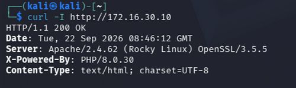
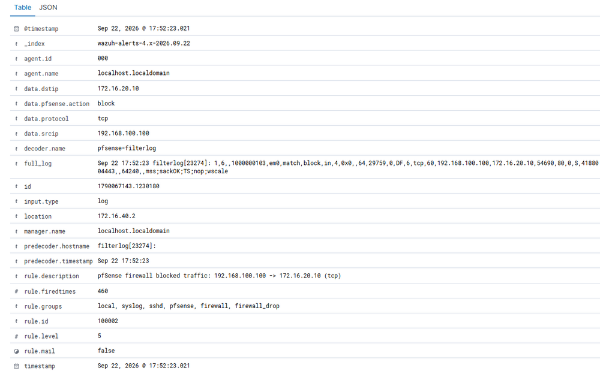
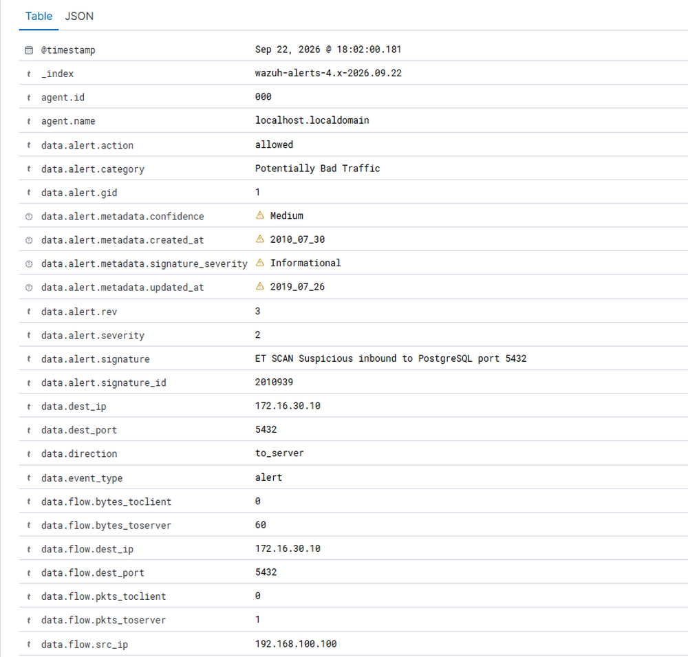
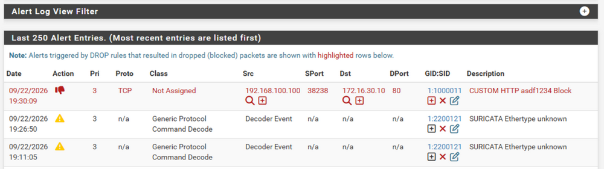
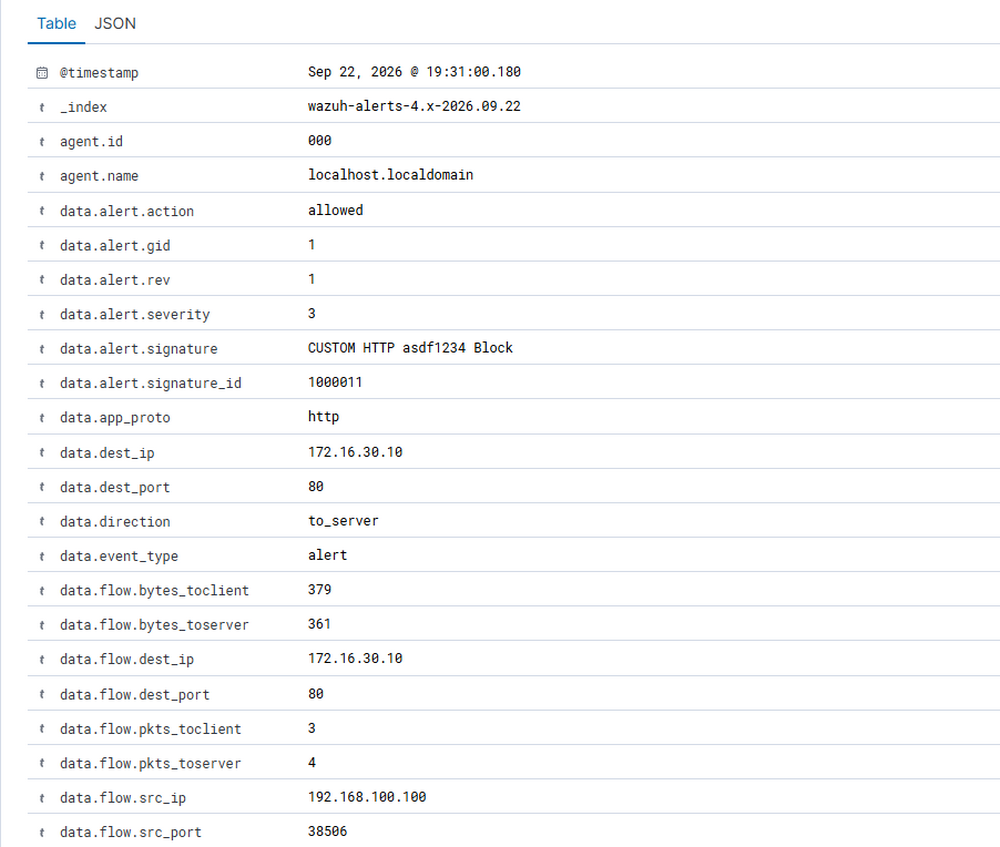
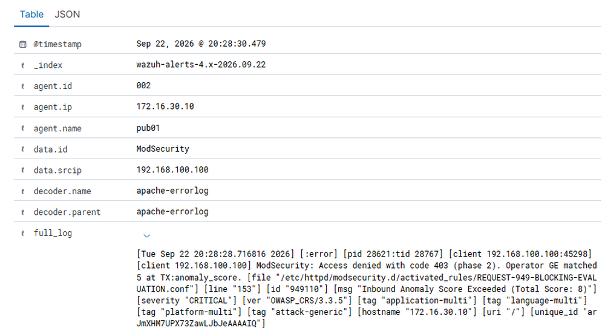
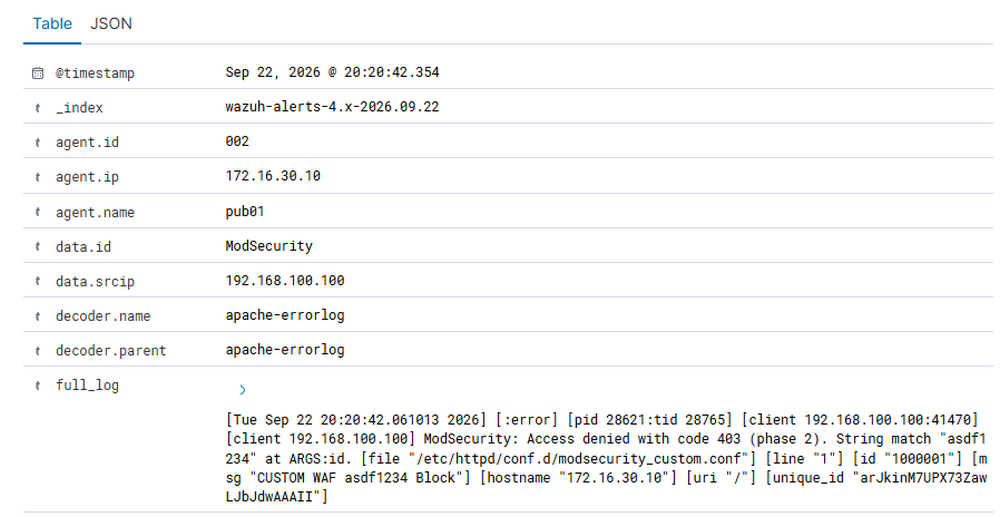
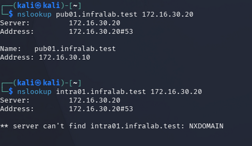
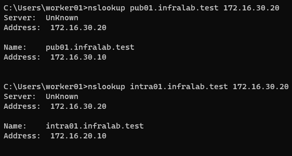

# 06 보안 테스트

본 문서는 구성한 접근통제 및 보안 정책의 동작을 테스트하고 결과를 검증한다.

## 1 pfSense Firewall 접근 통제 검증

외부 네트워크에서 DMZ 영역의 공개 서비스에는 접근할 수 있고, INTERNAL 영역의 서버에는 접근할 수 없도록 구성한 방화벽 정책의 동작을 검증하였다.

Kali에서 pub01의 TCP/80 HTTP 요청을 전송한 결과 `200 OK` 응답을 확인하였다.

`curl -I http://172.16.30.10`

반면 동일한 외부 네트워크의 Kali에서 intra01의 TCP/80 HTTP 요청을 전송한 결과 연결이 성립하지 않아 `Could not connect to server` 메시지를 확인하였다.

`curl -I http://172.16.20.10`

Wazuh에서 출발지 `192.168.100.100`, 목적지 `172.16.20.10`, TCP/80 트래픽에 대한 pfSense Firewall Block 이벤트를 확인하였다.

## 2 Suricata IDS/IPS 탐지 및 차단 검증

#### ET Open Rule 탐지

Kali에서 다음 명령으로 pub01을 대상으로 TCP SYN Scan을 수행하였다.

`nmap -sS 172.16.30.10`

그 결과 Suricata의 ET Open Scan Rule에서 스캔 트래픽과 관련된 다수의 이벤트가 탐지되었다.

대표적으로 `ET SCAN Suspicious inbound to PostgreSQL port 5432` 시그니처가 탐지되었으며, 해당 이벤트가 Wazuh에 정상적으로 수집되는 것을 확인하였다.

#### Custom Rule 차단

HTTP 요청에 `asdf1234` 문자열을 포함시켜 Custom Rule에 탐지되도록 다음 요청을 전송하였다.

`curl -I "http://172.16.30.10/?id=asdf1234"`

Suricata에서 Custom Rule이 동작하여 해당 트래픽이 차단되었으며, 관련 이벤트가 Wazuh에 정상적으로 수집되는 것을 확인하였다.

## 3 WAF 웹 공격 차단 검증

pub01에 적용한 ModSecurity와 OWASP CRS가 웹 요청을 정상적으로 탐지하고 차단하는지 검증하였다.

#### OWASP CRS 차단

SQL Injection 형태의 요청을 HTTPS로 전송하였다.

`curl -k "https://172.16.30.10/?id=%27%20OR%201%3D1%20--%20"`

그 결과 OWASP CRS의 탐지 로직에 의해 Anomaly Score 임계값을 초과하여, HTTP 403으로 차단되는 이벤트가 발생하였으며, Wazuh에 정상적으로 수집되는 것도 확인하였다.

#### Custom Rule 차단

요청 파라미터에 `asdf1234` 문자열이 포함될 경우 차단하도록 ModSecurity Custom Rule을 구성하고 다음 요청을 전송하였다.

`curl -k "https://172.16.30.10/?id=asdf1234"`

그 결과 Custom Rule에 의해 요청이 HTTP 403으로 차단되었으며, `CUSTOM WAF asdf1234 Block` 이벤트가 Wazuh에 정상적으로 수집되는 것도 확인하였다.

## 4 BIND View 동작 검증

질의 출발지 네트워크에 따라 내부 전용 DNS 레코드의 응답 여부가 다르게 동작하는지 검증하였다.

#### 외부 네트워크 질의

외부 네트워크의 Kali에서 ns01(`172.16.30.20`)을 대상으로 DNS 질의를 수행하였다.

`pub01.infralab.test`는 `172.16.30.10`으로 정상 응답하였으나, 내부 전용 레코드인 `intra01.infralab.test`는 `NXDOMAIN`이 반환되었다.

#### 내부 네트워크 질의

OFFICE 네트워크의 worker01에서 동일한 DNS 서버를 대상으로 질의를 수행하였다.

`pub01.infralab.test`는 `172.16.30.10`으로 응답하였으며, 내부 전용 레코드인 `intra01.infralab.test`도 `172.16.20.10`으로 정상 응답하였다.

이를 통해 외부에서는 공개 레코드만 제공하고 내부에서는 내부 전용 레코드까지 제공하도록 구성한 BIND View가 정상적으로 동작하는 것을 확인하였다.

